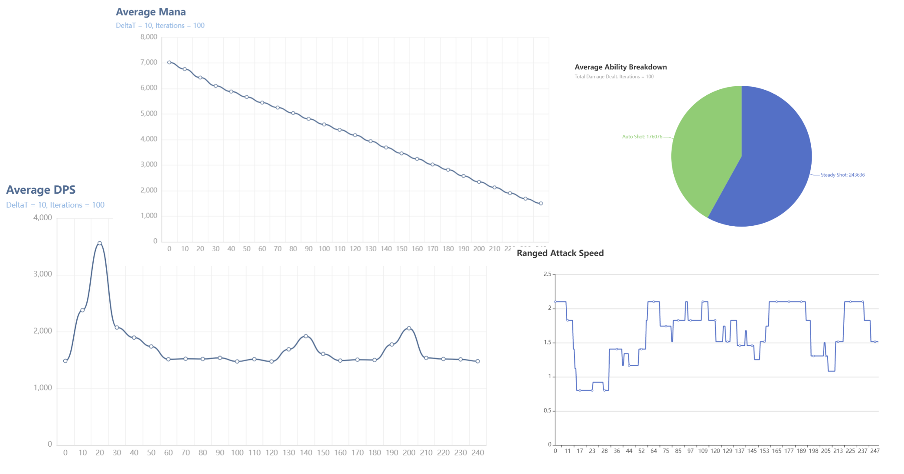

# TBC Hunter Sim

TBC Hunter Sim is a simulator for the hunter class in World of Warcraft - The Burning Crusade. It's a command-line utility that focuses on simulation fast and accurate results, allowing for different simulation presets to be passed. The final results are generated by simulating the fight `-i` number of times, returning the average of the results. 

**The simulator is still in an alpha stage, meaning it's still missing features**


## Install

The latest release can be downloaded from the [releases tab](/releases)

You can also install the sim with Go

`go install github.com/wheelbarrow777/tbchuntersim/`

## Usage
```
❯ ./tbchuntersim help run
Run a simulation

Usage:
  tbchuntersim run [flags]

Flags:
      --average-damage-iterations int   Number of iterations used when calculating average damage (default 50)
      --chart-bukcket-size int          The time delta of the average plots (default 10)
      --charts-folder string            Folder to save simulation charts in (default "charts/")
      --disable-charts                  If enabled, no charts will be produced
  -h, --help                            help for run
  -i, --iterations int                  Number of simulation iterations to be run (default 100)
  -f, --simulation-preset string        Simulation preset to be ran (default "preset.json")
  -w, --simulation-workers int          Number of simulation workers to run in parallel (default SYSTEM_NUM_CORES)

Global Flags:
      --config string      config file (default is $HOME/.huntsim.yaml)
      --log-level string   Desired logging level (INFO, DEBUG, WARNING, ERROR, TRACE) (default "INFO")
```

## Presets
A *preset* is a JSON file containing all the settings and parameters required to run a simulation. A default preset can be generated by running `tbchuntersim preset generate`. 

Top-level, the preset defines

- Race
- Equipment
- Consumables (Passive and Activated)
- Buffs
- Target Debuffs
- Talents
- Misc Sim Options (Duration of simulation, target armor, etc.)

Some pre-made presets can be found in the [presets folder](/presets)

### Modifying a preset
A preset can be modifier by either

- A) Opening the JSON in a text-editor and manually changing the values
- B) Using the `tbchuntersim preset modify` command

When using the `preset modify` command, specify which preset that should be modified and provide flags to specify what should be modified. This can either be flags such as `--enable-all-buffs`, or other presets called *modifier profiles*. A set of modifier profiles can be found in [/presets/modifier_profiles](/presets/modifier_profiles).

**Examples**
```
# All Buffs
tbchunersim preset modify mypreset.json --all-buffs

# All buffs, no consumables
tbchunersim preset modify mypreset.json --all-buffs --no-consumables

# Set modifier profile all_buffs.json
tbchuntersim preset modify testpreset.json -p presets/modifier_profiles/all_buffs.json
```

## Simulation Result
When a simulation is finished, the resulting DPS will be presented together with a breakdown of the different abilities. 


Additional information such as DPS over time and mana usage is generated as charts in the *charts* folder. (The charts folder defaults to ./charts if `--charts-folder` is unspecified)



## Adding an item to the item database

Currently, the only way to add an item to the database is to compile the codebase from source. One of the highest priority tasks on the roadmap is to re-do the item system, allowing for items to be added without having to re-compile the source code. Feel free to add a pull request with items you've added.

**To add an item do the following**
1. In [the itemdb folder](/itemdb), open the go file for the slot to add the item for. For instance *Rift Stalker Helmet* would be in [/itemdb/helmets.go](/itemdb/helmets.go)
2. In `func initHelmets()`, add the item to the slot map. For the rift stalker helmet, that would be the `helmets` map.

### Example

```
helmets["rift stalker helm"] = eq.ArmorItem{
	Name: "rift stalker helm",
	BaseStats: eq.BaseStats{
		Armor:       759,
		Agility:     40,
		Stamina:     36,
		Intellect:   25,
		AttackPower: 82,
		MP5:         10,
	},
	Gems: eq.GemSlots{
		SlotColors: []eq.GemColor{
			eq.YellowGem,
			eq.MetaGem,
		},
		Bonus: eq.BaseStats{
			Stamina: 6,
		},
	},
}
```

## FAQ

### Error - could not read simulation preset: myitem does not exist in the db

An equipment slot contains "myitem", which does not exist in the database.  See [Adding an item to the item database](#adding-an-item-to-the-item-database).

### Error - Could not load the simulation preset

The preset JSON file couldn't be found or read. Make sure the preset.json file exists in the same directory as the simulator, or that the `-f` flag points to a preset JSON. 

### I don't know what a command-line utility is, how do I run the sim?

This means that the simulator must be run from a terminal. 

**Windows**

Open *powershell* and navigate to the folder with the tbchuntersim.exe file. This can be done with the `cd` command. For instance, if you downloaded it to Downloads, type in `cd .\Downloads`. 

When in the folder containing the .exe file, the simulator can be run as follows

`.\tbchuntersim.exe run`

**MAC OS**

Open *terminal* and navigate to the folder with the tbchuntersim file. This can be done with the `cd` command. For instance, if you downloaded it to Downloads, type in `cd ./Downloads`. 

When in the folder containing the tbchuntersim file, the simulator can be run as follows

`.\tbchuntersim run`

**Linux**

If you're running on Linux, you know what a CLI is.

### Why do I sim higher with TBC Hunter Sim compared to the Sixx spreadsheet?

There might be many reasons for that, but some are:

- TBC Hunter Sim only simulates the hunter DPS, and doesn't take the pet DPS into account. Adding pet DPS is on the roadmap. 
- The Sixx spreadsheet simulator is in Google Sheets, and its floating points have low resolution and thus lower accuracy. This causes more rounding errors, which are not present in this sim (at least not to the same extent). These rounding errors impacts delay between each ability.
- This simulator does not take latency into account
- There is a bug somewhere

In general, expect this sim to give about **4%** higher numbers. See the table below for a comparison between the two sims with different buffs enabled. 

|              | No Buff | Paladin  | LoTP     | Grace    | GOTW     | Bloodlust | Drums    | JC Neck  | Judgement Crusader | Expose Weakness | Sunder Armor | Improved Expose Armor | Curse of Recklessness | Faeri Fire Base | Faeri Fire Improved | Ferocius Inspiration | Haste Potion |
| ------------ | ------- | -------- | -------- | -------- | -------- | --------- | -------- | -------- | ------------------ | --------------- | ------------ | --------------------- | --------------------- | --------------- | ------------------- | -------------------- | ------------ |
| Sixx         | 772     | 845      | 811      | 804      | 779      | 804       | 788      | 782      | 795                | 817             | 892          | 918                   | 805                   | 797             | 799                 | 837                  | 818          |
| TBCHunterSim | 802     | 881      | 843      | 837      | 812      | 840       | 814      | 813      | 827                | 846             | 929          | 959                   | 839                   | 830             | 830                 | 870                  | 858          |
| Diff         | 1,03886 | 1,042604 | 1,039457 | 1,041045 | 1,042362 | 1,044776  | 1,032995 | 1,039642 | 1,040252           | 1,035496        | 1,04148      | 1,044662              | 1,042236              | 1,041405        | 1,038798            | 1,039427             | 1,0489       |

## Roadmap

- [ ] Add Pet DPS
- [ ] Add a Dynamic Item Database (which doesn't require re-compliation)
- [ ] Add Dwarf and Troll racials
- [ ] Add full talent support
- [ ] Add multi shot and arcane shot
- [ ] Add melee weaving
- [ ] Add all relevant items to the itemdb
- [ ] Add memoization to speed up computation